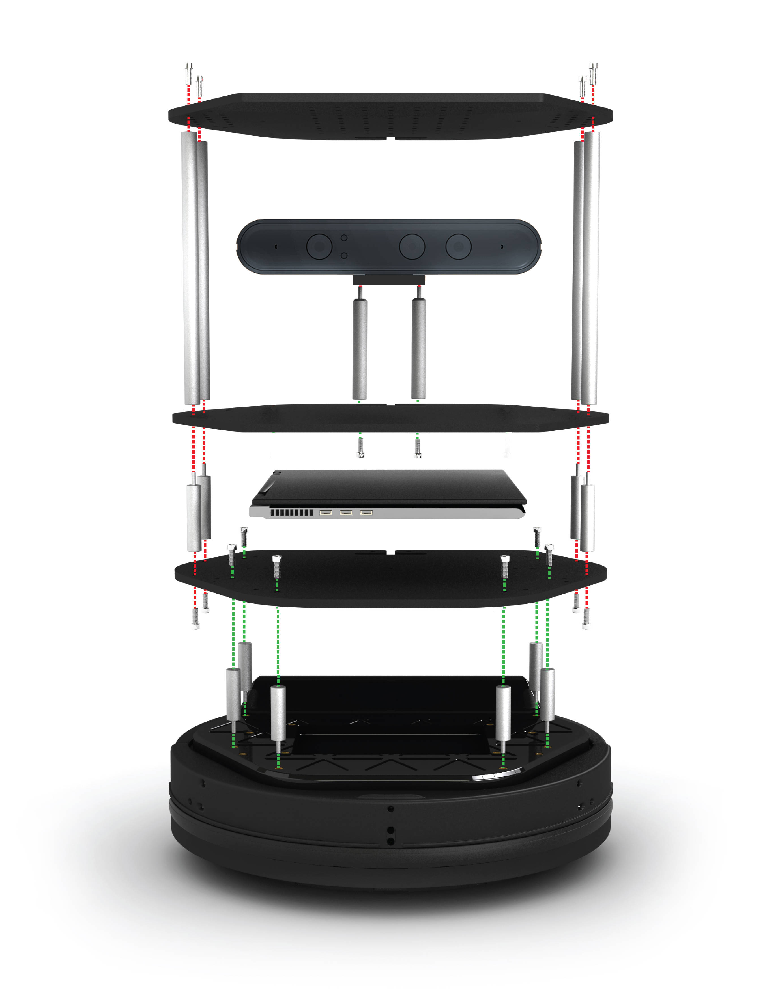
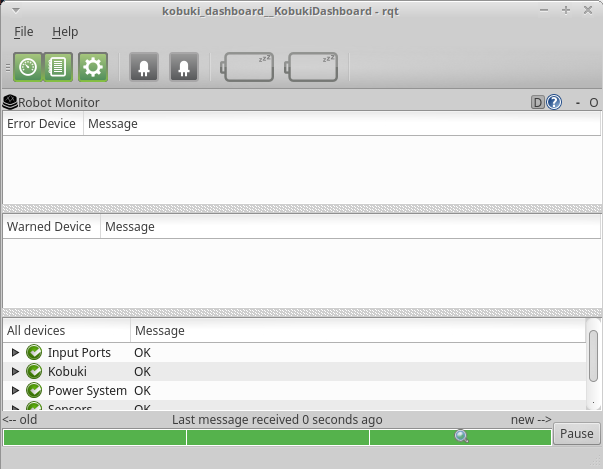

# Turtlebot Setup
- [ ] Overview
- [ ] Physical Setup
- [x] Laptop Setup
- [ ] Network Setup
- [ ] Turtlebot Bringup
- [ ] Testing Kobuki Setup
- [ ] Orbbec Astra Bringup

## Overview
TurtleBot 2 is an open robotics platform designed for education and research on state of art robotics. It is also a powerful  tool to teach and learn ROS (Robot Operating System) and make the most of this cutting edge techonology. Equipped with a 3D sensor, it can map and navigate indoor enviroments. Due to the Turtlebot's modularity, you can attach your own sensors, electronics, and mechanics easily.

## Physical Setup



## Laptop Setup
### Installing Ubuntu 16.04 and ROS Kinetic

- Using the Turtlebot 16.04 USB stick
  - Insert USB stick into laptop
- Power on laptop
- Hit F12 until in boot menu
- Select boot from flash drive device
- Install Ubuntu
  - [Follow the Ubuntu Installation Guide](https://www.ubuntu.com/download/desktop/install-ubuntu-desktop)
- Power off and remove installation media

- Install ROS Kinetic Desktop-Full
  - [Follow the ROS Ubuntu installation guide](http://wiki.ros.org/kinetic/Installation/Ubuntu)
- Install Turtlebot packages
  - `sudo apt install ros-kinetic-turtlebot* ros-kinetic-astra-*`
- Install necessary programs we will be using
  - `sudo apt install git chrony`

- (Optional) Install Turtlebot Branding
```
mkdir ~/tmp && cd ~/tmp
git clone https://github.com/TurtleBot-Mfg/turtlebot-doc-indigo
git clone https://github.com/TurtleBot-Mfg/turtlebot-env-indigo
git clone https://github.com/TurtleBot-Mfg/turtlebot-branding-indigo
git clone https://github.com/TurtleBot-Mfg/turtlebot-wallpapers
sudo cp -r ~/tmp/turtlebot-branding-indigo/root/lib/plymouth/themes /usr/share/plymouth/themes
sudo cp -r ~/tmp/turtlebot-branding-indigo/root/usr/share/themes /usr/share/plymouth/themes
sudo cp -r ~/tmp/turtlebot-doc-indigo/root/etc/skel/* /etc/skel/.
cp ~/tmp/turtlebot-doc-indigo/root/etc/skel/Desktop/turtlebot-doc.desktop ~/Desktop
sudo cp -r ~/tmp/turtlebot-doc-indigo/root/usr/share/doc/turtlebot /usr/share/doc/.
sudo cp -r ~/tmp/turtlebot-env-indigo/root/etc/* /etc/.
sudo cp -r ~/tmp/turtlebot-env-indigo/root/usr/share/glib-2.0/schemas /usr/share/glib-2.0/schemas/.
sudo /usr/bin/glib-compile-schemas /usr/share/glib-2.0/schemas/
sudo cp -r ~/tmp/turtlebot-wallpapers/root/usr/share/backgrounds/* /usr/share/backgrounds/.
```
- You may need to setup the backgrounds yourself by right-clicking on the desktop

- Install Orbbec Astra udev rules
```
mkdir ~/tmp
cd ~/tmp
wget https://raw.githubusercontent.com/orbbec/astra/master/install/orbbec-usb.rules
sudo cp orbbec-usb.rules /etc/udev/rules.d/.
```

- Setup Turtlebot Parameters in Bashrc
```
echo export TURTLEBOT_BASE=kobuki >> ~/.bashrc
echo export TURTLEBOT_3D_SENSOR=astra >> ~/.bashrc
echo export TURTLEBOT_STACK=hexagons >> ~/.bashrc 
```

Due to incorrect NTP time servers, you should configure the same NTP zone between all ROS computers:
- In a new terminal
  - sudo ntpdate ntp.ubuntu.com


## Network Setup
- Using the Network Manager in the upper-righthand corner of Ubuntu, connect to a Wireless, Ethernet, or Cellular network.


Find the current IP for the Turtlebot
- In a new terminal
  - `hostname -I`

- Add the network parameters to your BashRC
```
echo export ROS_MASTER_URI=http://$(hostname -I):11311 >> ~/.bashrc
echo export ROS_IP=$(hostname -I) >> ~/.bashrc
echo export ROS_HOSTNAME=$(hostname -I) >> ~/.bashrc
echo export ROS_HOME=~/.ros >> ~/.bashrc
```

## Turtlebot Bringup
The Turtlebot Bringup package contains all the neccesary configuration and launch files to load the Turtlebot drivers.

The minimal.launch file starts up the Kobuki base drivers and the basic Turtlebot configuration settings for ROS
- In a new terminal
  - `roslaunch turtlebot_bringup minimal.launch`

You should hear a chime from the Kobuki once ROS has connected to it.

## Testing Kobuki
There is a GUI to check out the Kobuki status
- In a new terminal
  - `roslaunch turtlebot_dashboard turtlebot_dashboard.launch`
- It should look like this if everything is OK:


You can test drive the Kobuki base by using the Keyboard teleop launch file located in the turtlebot_teleop package
- In a new terminal
  - `roslaunch turtlebot_teleop keyboard_teleop.launch`


## Orbbec Astra Bringup
You can bring up the Orbbec Astra drivers by using the 3d_sensor launch file located in the turtlebot_bringup package
- In a new terminal
  - `roslaunch turtlebot_bringup 3dsensor.launch`

## Seeing Orbbec Astra data

- In a new terminal
  - `rosrun rqt_image_view rqt_image_view`

Astra Topics:
| Topic               | Description |
| ------------------- | ----------- |
| /camera/depth/*     | Depth Image
| /camera/ir/*        | 2D infrared image
| /camera/image_raw/* | raw RGB image
