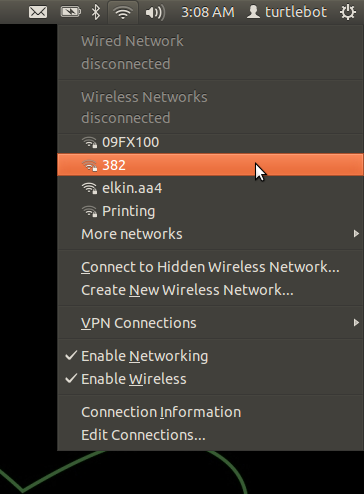

# Master Laptop Setup
- [ ] Overview
- [ ] Physical Setup
- [x] Laptop Setup
- [ ] Network Setup
- [ ] Network Testing
- [ ] Turtlebot Teleop

## Overview
The Master Laptop will allow control and data streaming of the Turtlebot and its sensors.
This setup requires Ubuntu 16.04 running on a dedicated machine.

Running under a virtual machine is do-able, but will not be sustainable.

## Physical Setup
...

## Laptop Setup
Refer to [01-Turtlebot_Setup.md](01-Turtlebot_Setup.md) for instructions on `Installing Ubuntu 16.04 and ROS Kinetic`

## Network Setup
- Using the Network Manager in the upper-righthand corner of Ubuntu, connect to a Wireless, Ethernet, or Cellular network.


Find the current IP for the Turtlebot
- In a new terminal on the Turtlebot
  - `hostname -I`
- This is the IP_OF_TURTLEBOT you need to replace in the network parameters

Find the current IP for the Master
- In a new terminal on the master laptop
  - `hostname -I`

- Add the network parameters to your BashRC
```
echo export ROS_MASTER_URI=http://IP_OF_TURTLEBOT:11311 >> ~/.bashrc
echo export ROS_IP=$(hostname -I) >> ~/.bashrc
echo export ROS_HOSTNAME=$(hostname -I) >> ~/.bashrc
echo export ROS_HOME=~/.ros >> ~/.bashrc
```

## Network Testing
ROS requires completely free network connectivity between the Turtlebot and the Master computer.

The first test is the basic Ping between the Master and the Turtlebot:
- `ping IP_OF_TURTLEBOT`

You should see the following returned if the Turtlebot is on the network:
```
PING IP_OF_TURTLEBOT (IP_OF_TURTLEBOT) 56(84) bytes of data.
64 bytes from IP_OF_TURTLEBOT: icmp_seq=1 ttl=64 time=66.8 ms
```
If you continue to have issues, check out the [Network Setup Page](http://wiki.ros.org/ROS/NetworkSetup)

## Turtlebot Teleop
Now that you have configured the network connections and are able to ping between machines, you can control the turtlebot from the master using the Keyboard Teleop launch file.

- Open a new terminal on the master laptop
  - `roslaunch turtlebot_teleop keyboard_teleop.launch`

You should see the IP_OF_TURTLEBOT near the top of the terminal window.

