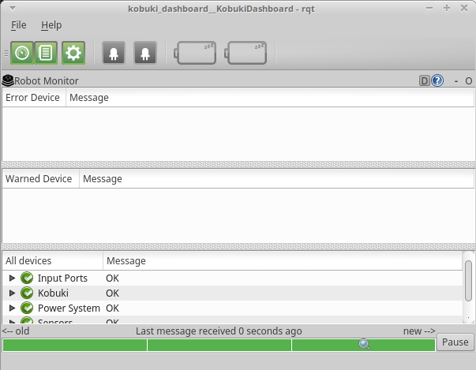

## Turtlebot Bringup
The Turtlebot Bringup package contains all the neccesary configuration and launch files for loading the Turtlebot drivers.

The minimal.launch file starts up the Kobuki base drivers and the basic Turtlebot configuration settings for ROS. 
To load the minimal.launch file, enter:
```bash
 roslaunch turtlebot_bringup minimal.launch
 ```
You should hear a chime from the Kobuki once ROS has connected to it.

## Testing Kobuki
Launch the GUI to check out the Kobuki status:
 ```bash
 roslaunch turtlebot_dashboard turtlebot_dashboard.launch
``` 
If everything is OK, it should look like this:


You can test drive the Kobuki base by using the Keyboard teleop launch file located in the turtlebot_teleop package
```bash
roslaunch turtlebot_teleop keyboard_teleop.launch
```


## Orbbec Astra Bringup
You can bring up the Orbbec Astra drivers by using the 3d_sensor launch file located in the turtlebot_bringup package
```bash
roslaunch turtlebot_bringup 3dsensor.launch
```

## Seeing Orbbec Astra data

```bash
rosrun rqt_image_view rqt_image_view
```
Astra Topics:

| Topic               | Description |
| ------------------- | ----------- |
| /camera/depth/*     | Depth Image |
| /camera/ir/*        | 2D infrared image |
| /camera/image_raw/* | raw RGB image |
