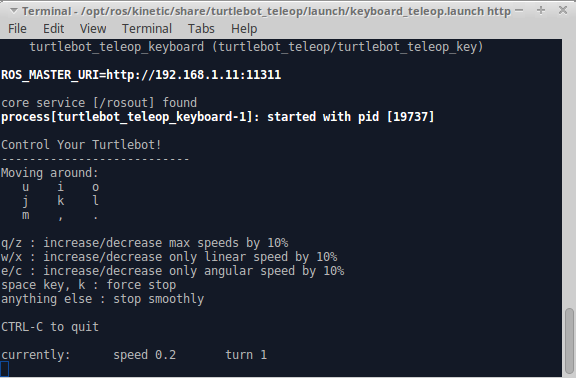

## Turtlebot Teleop
Now that you have configured the network connections and are able to ping between machines, you can control the turtlebot from the master using the Keyboard Teleop launch file.

- Open a new terminal on the master laptop
  - `roslaunch turtlebot_teleop keyboard_teleop.launch`

You should see the IP_OF_TURTLEBOT near the top of the terminal window.

