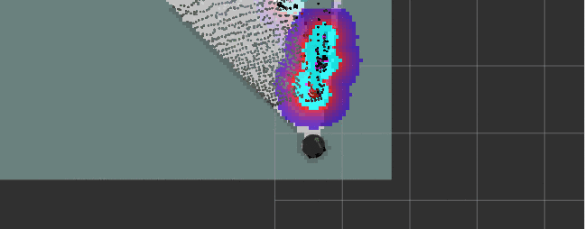
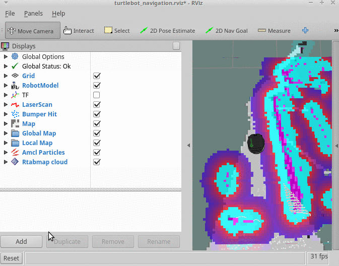
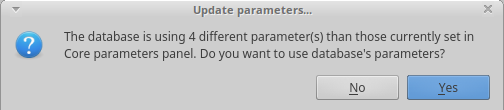
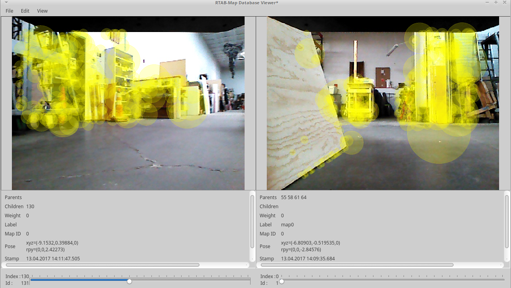
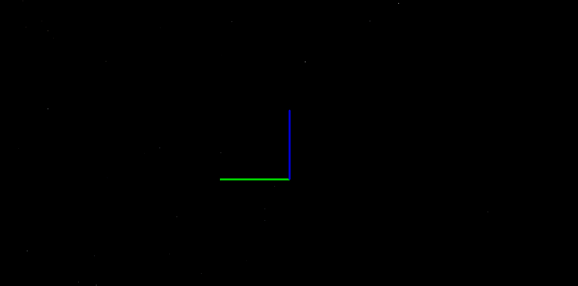

## 3D SLAM with RGB-D Sensors
An RGB-D sensor, like the Orbbec Astra or Microsoft Kinect, houses a color camera (RGB) along with a depth camera (D).
Using the depth sensor, we can map the color image on top of the depth image to get a 3D color image.

RTABMAP combines gmapping with 3D SLAM in order to do autonomous navigation (in the next tutorials) while 3D mapping.

## RTABMAP
RTABMAP (Real-Time Appearance-Based Mapping) is a RGB-D Graph-Based SLAM approach based on an incremental appearance-based global Bayesian loop closure detector.

## Installation
These instalation steps are to be done on BOTH the Turtlebot and Master computers.

1. Connect to a Wi-Fi network that has internet access
2. Open a new terminal
    1. `sudo apt-get install ros-kinetic-rtabmap-ros`
3. Connect back to your Turtlebot Wi-Fi network.

## Starting RTABMAP on the Turtlebot
In order to start and configure RTABMAP properly, we need to create our own launch file on the Turtlebot.

1. Create a workspace folder on the Turtlebot computer:
    1. On the Turtlebot Computer, open a new terminal
        * `mkdir ~/workspace`
        * `cd ~/workspace`

2. Create a new launch file to start RTABMAP on the Turtlebot with default configurations:
    1. On the Turtlebot computer, open a new terminal
        * `cd ~/workspace`
        * `gedit rtabmap.launch`
    2. Copy and paste the following code into gedit:
```xml
<launch>
  <arg name="database_path"     default="rtabmap.db"/>
  <arg name="localization"      default="false"/>
  <arg name="rgbd_odometry"     default="false"/>
  <arg name="args"              default=""/>
  <arg name="rtabmapviz"        default="false"/>
  
  <arg name="wait_for_transform"  default="0.2"/> 
  <!-- Navigation stuff (move_base) -->
  <include file="$(find turtlebot_bringup)/launch/3dsensor.launch">
    <arg name="scan_topic" value="/scan" />
  </include>
  
  <!-- Mapping -->
  <group ns="rtabmap">

    <node name="rtabmap" pkg="rtabmap_ros" type="rtabmap" output="screen" args="$(arg args)">
	  <param name="database_path"       type="string" value="$(arg database_path)"/>
	  <param name="frame_id"            type="string" value="base_footprint"/>
	  <param name="odom_frame_id"       type="string" value="odom"/>
	  <param name="wait_for_transform_duration"  type="double"   value="$(arg wait_for_transform)"/>
	  <param name="subscribe_depth"     type="bool"   value="true"/>
	  <param name="subscribe_scan"      type="bool"   value="true"/>
	
	  <!-- inputs -->
	  <remap from="scan"            to="/scan"/>
	  <remap from="rgb/image"       to="/camera/rgb/image_rect_color"/>
  	  <remap from="depth/image"     to="/camera/depth_registered/image_raw"/>
  	  <remap from="rgb/camera_info" to="/camera/rgb/camera_info"/>
  	  
  	  <!-- output -->
  	  <remap from="grid_map" to="/map"/>
	
	  <!-- RTAB-Map's parameters: do "rosrun rtabmap rtabmap (double-dash)params" to see the list of available parameters. -->
	  <param name="RGBD/ProximityBySpace"        type="string" value="true"/>   <!-- Local loop closure detection (using estimated position) with locations in WM -->
	  <param name="RGBD/OptimizeFromGraphEnd"    type="string" value="false"/>  <!-- Set to false to generate map correction between /map and /odom -->
	  <param name="Kp/MaxDepth"                  type="string" value="8.0"/>
	  <param name="Reg/Strategy"                 type="string" value="1"/>      <!-- Loop closure transformation refining with ICP: 0=Visual, 1=ICP, 2=Visual+ICP -->
	  <param name="Icp/CoprrespondenceRatio"     type="string" value="0.3"/>
	  <param name="Vis/MinInliers"               type="string" value="5"/>      <!-- 3D visual words minimum inliers to accept loop closure -->
	  <param name="Vis/InlierDistance"           type="string" value="0.1"/>    <!-- 3D visual words correspondence distance -->
	  <param name="RGBD/AngularUpdate"           type="string" value="0.436"/>    <!-- Update map only if the robot is moving -->
	  <param name="RGBD/LinearUpdate"            type="string" value="0.5"/>    <!-- Update map only if the robot is moving -->
	  <param name="Rtabmap/TimeThr"              type="string" value="700"/>
	  <param name="Mem/RehearsalSimilarity"      type="string" value="0.30"/>
	  <param name="Optimizer/Slam2D"             type="string" value="true"/>
	  <param name="Reg/Force3DoF"                type="string" value="true"/>   
	  
	  <!-- localization mode -->
	  <param     if="$(arg localization)" name="Mem/IncrementalMemory" type="string" value="false"/>
	  <param unless="$(arg localization)" name="Mem/IncrementalMemory" type="string" value="true"/>
	  <param name="Mem/InitWMWithAllNodes" type="string" value="$(arg localization)"/> 
    </node>
   
    <!-- Odometry : ONLY for testing without the actual robot! /odom TF should not be already published. -->
    <node if="$(arg rgbd_odometry)" pkg="rtabmap_ros" type="rgbd_odometry" name="rgbd_odometry" output="screen">
      <param name="frame_id"                    type="string" value="base_footprint"/>
      <param name="wait_for_transform_duration" type="double" value="$(arg wait_for_transform)"/>
      <param name="Reg/Force3DoF"               type="string" value="true"/>
      <param name="Vis/InlierDistance"          type="string" value="0.05"/>
      
      <remap from="rgb/image"       to="/camera/rgb/image_rect_color"/>
      <remap from="depth/image"     to="/camera/depth_registered/image_raw"/>
      <remap from="rgb/camera_info" to="/camera/rgb/camera_info"/>
    </node>
    
    <!-- visualization with rtabmapviz -->
    <node if="$(arg rtabmapviz)" pkg="rtabmap_ros" type="rtabmapviz" name="rtabmapviz" args="-d $(find rtabmap_ros)/launch/config/rgbd_gui.ini" output="screen">
  	  <param name="subscribe_depth"             type="bool" value="true"/>
      <param name="subscribe_scan"              type="bool" value="true"/>
      <param name="frame_id"                    type="string" value="base_footprint"/>
      <param name="wait_for_transform_duration" type="double" value="$(arg wait_for_transform)"/>
    
      <remap from="rgb/image"       to="/camera/rgb/image_rect_color"/>
      <remap from="depth/image"     to="/camera/depth_registered/image_raw"/>
      <remap from="rgb/camera_info" to="/camera/rgb/camera_info"/>
      <remap from="scan"            to="/scan"/>
    </node>
    
  </group>

  <include file="$(find turtlebot_navigation)/launch/includes/move_base.launch.xml"/>

</launch>
```

3. On Turtlebot, start minimal.launch
    1. `roslaunch turtlebot_bringup minimal.launch`

4. On Turtlebot, start the rtabmap.launch 
    1. `cd ~/workspace`
    2. `roslaunch rtabmap.launch database_path:=~/workspace/rtabmap.db`
        * the rtabmap.launch automatically launches 3dsensor.launch
        * the argument `database_path:=` is the location of the database file
            * if no database exists, rtabmap will create a new one

## Visualizing RTABMAP data

1. On the master computer, start RVIZ
    1. `roslaunch rtabmap_ros demo_turtlebot_rviz.launch`

2. On the master computer, start keyboard teleop
    1. `roslaunch turtlebot_teleop keyboard_teleop.launch`

3. Drive the Turtlebot around your map using the keyboard_teleop, and visualize the collected data in RVIZ.
    * In order to collect data fully, you will need to stop the turtlebot periodically and slowly turn the turtlebot in circles
    

    * You can bring up an image view in RVIZ by adding a new display:  
      * Under "Displays" click the "Add" button
      * Click the "By Topic" tab
      * Select the drop-down for `/camera/rgb/image_raw`
      * Click on "Image"
      * Click "Ok"
    

    * While you drive the Turtlebot around, it will begin to generate a map
    
      * The white in the map is known empty space
      * The dark borders around the white are known obstacles such as walls and other objects
      * The grey tiles surrounding the map is unknown space
      * The 3d points that are verified using closed-loop detection will be shown in RVIZ


## Viewing the RTABMAP data
RTABMAP provides their own tool to visualize and manipulate data.  
With the `rtabmap-databaseViewer` tool, you can:
  - Open rtabmap databases
  - View rtabmap 2d and 3d data
  - Detect more loop closures
  - Refine detected loop closures
  - Generate a 3D map file (.ply, .pcd)
  - Generate 2D-3D laser scans (.ply, .pcd)

1. Copy the database from the Turtlebot to the Master Computer
    1. On the Master Computer, open a new terminal:
        * `mkdir ~/workspace`
        * `cd ~/workspace`
        * `scp turtlebot@IP_OF_TURTLEBOT:~/workspace/rtabmap.db .`
          * The remote copy operation may take some time depending on the database size

2. Use `rtabmap-databaseViewer` to view the rtabmap data
    1. On the master computer, in a terminal:
        * `cd ~/workspace`
        * `rtabmap-databaseViewer rtabmap.db
    2. If a prompt comes up to Update Parameters
        * Press "Yes"
        
    3. The default display in the database viewer shows the loop closure detection  
    
    4. To view the 3D map:
        * Press "Edit" on the top bar
        * Press "View 3D Map"
        * Select "4" and hit "OK"
        * Type "8.0" and hit "OK"
        * Scroll out and move around the 3D point coud map  
        

## Tuning RTABMAP Parameters
Coming soon, we are working out the best parameters to use with this Turtlebot setup

